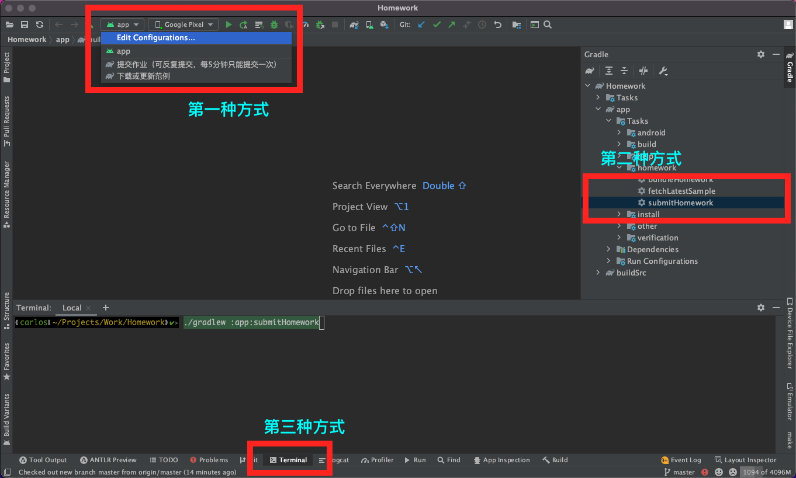

# 作业说明

## 环境准备

1. 运行此项目需要使用JDK 11, 在Android Studio的设置里 [Preferences | Build, Execution, Deployment | Build Tools | Gradle](jetbrains://AndroidStudio/settings?name=Build%2C+Execution%2C+Deployment--Build+Tools--Gradle) 处配置JDK；
2. 在local.properties中，需要配置以下内容

   ```
   username=你的名字（中文汉字）
   email=你的公司邮箱地址（不带@apusapps.com后缀）
   password=你的邮箱密码
   ```

## 作业内容

在 `app/src/main/java/org/example/app/homework/MainActivity.java` 文件中，完成以下部分代码：

1. 通过GET请求，从http://res.xingcheng.me/service/api/messages 拿到json数据
2. 拿到json后，解析并创建IMMessage对象，并通知UI更新


## 注意事项

1. 网络请求使用Okhttp，JSON解析使用 android自带的org.json.JSONObject；
2. 项目已经添加 okhttp 和 glide 的依赖，这些库已经足够完成作业，请尽量不要引入其他依赖；

## 如何提交作业？

1. 作业完成以后，请通过git提交改动，确保项目内没有任何未提交的改动
2. 在电脑网络畅通的情况下（家里的网络也可以），执行gradle的任务 `submitHomework` 把作业提交给我。具体有三种执行方式：

    1. 点开Android Studio上面一排按钮的运行配置下拉选单，选择 `提交作业（可反复提交，每5分钟只能提交一次）` 这一项后，点击绿色 ▶ 按钮；️
    2. 点开Android Studio底部的 Terminal 标签打开终端，在终端执行 `./gradlew :app:submitHomework` 命令;
    3. 点开Android Studio右边的 Gradle 标签，找到 app > homework > submitHomework 的任务，双击执行.



## 如何获取我提供的范例？

在每堂课讲解结束后，我会发布课上讲解的范例。届时可以使用gradle任务 `fetchLatestSample` 获取和刷新范例。范例储存在项目里的 samples文件夹下。
